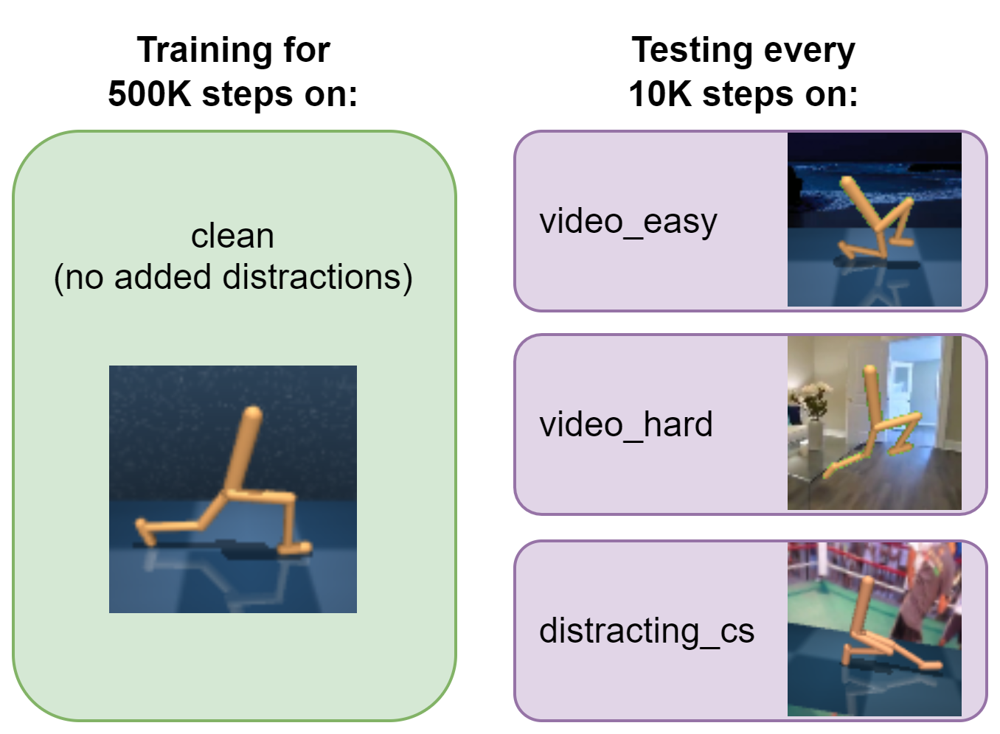
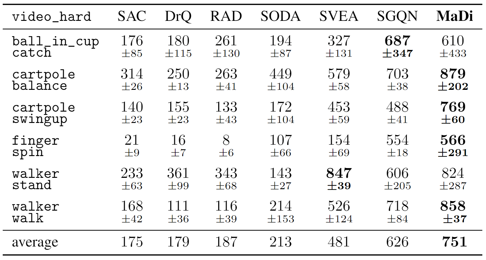
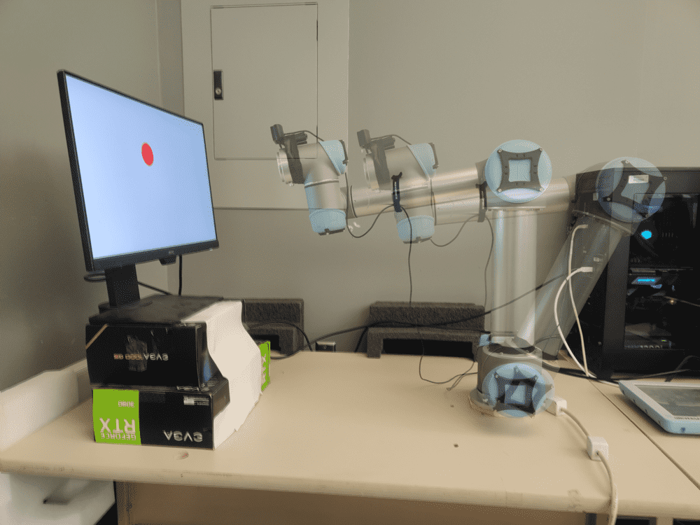

# MaDi
_Learning to **Ma**sk **Di**stractions for Generalization in Visual Deep Reinforcement Learning_

See our [paper](https://arxiv.org/abs/2312.15339) and [40-second video](https://www.youtube.com/watch?v=2oImF0h1k48).
If you use this code, please cite:
```
@article{grooten2024madi,
    title={{MaDi: Learning to Mask Distractions for Generalization in Visual Deep Reinforcement Learning}}, 
    author={Grooten, Bram and Tomilin, Tristan and Vasan, Gautham and Taylor, Matthew E and Mahmood, A Rupam and Fang, Meng and Pechenizkiy, Mykola and Mocanu, Decebal Constantin},
    year={2024},
    journal={The 23rd International Conference on Autonomous Agents and Multiagent Systems (AAMAS)},
    note={URL: \url{https://arxiv.org/abs/2312.15339}}
}
```


This codebase builds on the [DMControl Generalization Benchmark](https://github.com/nicklashansen/dmcontrol-generalization-benchmark),
which in turn is based on the [DeepMind Control Suite](https://github.com/deepmind/dm_control) 
and also integrates a set of challenging test environments from 
the [Distracting Control Suite](https://arxiv.org/abs/2101.02722).


## Algorithms

This repository contains implementations of the following algorithms in a unified framework:

- [**MaDi** (ours: Grooten et al., 2023)](https://arxiv.org/abs/2312.15339)
- [SGQN (Bertoin et al., 2022)](https://arxiv.org/abs/2209.09203)
- [SVEA (Hansen et al., 2021)](https://arxiv.org/abs/2107.00644)
- [SODA (Hansen and Wang, 2021)](https://arxiv.org/abs/2011.13389)
- [CURL (Srinivas et al., 2020)](https://arxiv.org/abs/2004.04136)
- [PAD (Hansen et al., 2020)](https://arxiv.org/abs/2007.04309)
- [RAD (Laskin et al., 2020)](https://arxiv.org/abs/2004.14990)
- [DrQ (Kostrikov et al., 2020)](https://arxiv.org/abs/2004.13649)
- [SAC (Haarnoja et al., 2018)](https://arxiv.org/abs/1812.05905)

using standardized architectures and hyperparameters, wherever applicable.
We test our algorithms on environments with distracting backgrounds.




## Setup

Tested on Linux (and on Windows with 
[WSL](https://learn.microsoft.com/en-us/windows/wsl/install)).

We first need to install MuJoCo v2.0:
```
mkdir -p ~/.mujoco
cd ~/.mujoco
wget https://www.roboti.us/download/mujoco200_linux.zip 
wget https://www.roboti.us/file/mjkey.txt
unzip mujoco200_linux.zip 
rm mujoco200_linux.zip
```

We assume that you have access to a GPU with CUDA >=9.2 support. All dependencies can then be installed 
with the following commands:

```
conda env create -f setup/conda.yaml
conda activate madi
sh setup/install_envs.sh
```

Then continue with the datasets below.


## Datasets
Part of this repository relies on external datasets.
The Distracting Control Suite uses 
the [DAVIS](https://davischallenge.org/davis2017/code.html) 
dataset (~1GB, 12K files) for video backgrounds. 
We use the [Places](http://places2.csail.mit.edu/download.html) 
dataset (~24GB, 1.8M files) for data augmentation.
The DMControl Generalization Benchmark uses a subset (~100MB, 110 files) of 
the [RealEstate10K](https://google.github.io/realestate10k/) 
dataset for background rendering.
Familiarize yourself with their terms before downloading.
You can download and set it up with:

```
mkdir dmcgb_datasets  # this can be outside the project directory, where you prefer
cd dmcgb_datasets

wget https://data.vision.ee.ethz.ch/csergi/share/davis/DAVIS-2017-trainval-480p.zip
unzip -q DAVIS-2017-trainval-480p.zip
rm DAVIS-2017-trainval-480p.zip

wget http://data.csail.mit.edu/places/places365/places365standard_easyformat.tar
tar -xf places365standard_easyformat.tar
rm places365standard_easyformat.tar
```

After downloading and extracting the data, set your dataset directory with:
```
export DMCGB_DATASETS="/path/to/dmcgb_datasets"
```

When running on a compute cluster, you probably also need this:
```
export MUJOCO_GL=egl
```


## Training & Evaluation

For a training run, `cd` back to the main project directory.
Then, to run MaDi on the default task, `walker_walk`, use:
```
python src/train.py --algorithm madi --augment overlay --seed 42 --wandb_mode disabled
```

Use `--save_video` to see the agent in action. For MaDi, 
you can also use `--save_mask` to view associated masks in your logs directory. 
See `src/arguments.py` for all the arguments.

This should give you an output of the form:
```
Working directory: logs/walker_walk/madi/42
Evaluating: logs/walker_walk/madi/42
| eval | S: 0 | ER: 22.8882 | ERTEST: 0.0000 | ERTESTCOLOR: 0.0000 | ERTESTVIDEASY: 0.0000 | ERTESTVIDHARD: 0.0000 | ERTESTDCS: 0.0000
| train | E: 1 | S: 250 | D: 105.4 s | R: 0.0000 | ALOSS: 0.0000 | CLOSS: 0.0000 | AUXLOSS: 0.0000 | SALOSS: 0.0000 | CONTRALOSS: 0.0000
```
where `ER` corresponds to the average episode return. Training and test environment evaluations are shown. 
You can select the test environment used in evaluation with the `--eval_mode` argument, which accepts one 
of `(distracting_cs, video_hard, video_easy, color_hard, color_easy, none)`. Use `none` if you want to 
disable continual evaluation of generalization.


## Troubleshooting

If you get errors after installation, you might miss some packages. 
See `setup/troubleshooting.md` for some common issues.


## Results

We provide test results for each of the MaDi, SGQN, SVEA, SODA, RAD, DrQ, and SAC methods. 
Results for `video_hard` are shown below:



See our paper for additional results. 
For reproducibility, we provide the full results for all methods and environments [here](https://drive.google.com/drive/folders/1RkEoKlZTHFroN4A2YzF1AAJuFdo86cjW?usp=sharing).

## Robotic experiments

Our code for the UR5 Robotic Arm experiments is available 
at [github.com/bramgrooten/relod](http://github.com/bramgrooten/relod).
See multiple baselines in action on the challenging UR5-VisualReacher task 
in our [video](https://youtu.be/TQMazg6dntE).




## Acknowledgements

We would like to thank the numerous researchers and engineers involved in work of which this work is based on.
Our SAC implementation is based on [this repository](https://github.com/denisyarats/pytorch_sac_ae), 
and here are the links to the original [DMControl](https://github.com/deepmind/dm_control) repository
and the [gym wrapper](https://github.com/denisyarats/dmc2gym). 
The [Distracting Control Suite](https://arxiv.org/abs/2101.02722) environments were adapted from 
[this](https://github.com/google-research/google-research/tree/master/distracting_control) implementation. 
The original implementations of the other methods are available at:
[RAD](https://github.com/MishaLaskin/rad), 
[DrQ](https://github.com/denisyarats/drq),
[CURL](https://github.com/MishaLaskin/curl),
[PAD](https://github.com/nicklashansen/policy-adaptation-during-deployment),
[SVEA and SODA](https://github.com/nicklashansen/dmcontrol-generalization-benchmark)
and
[SGQN](https://github.com/SuReLI/SGQN).
